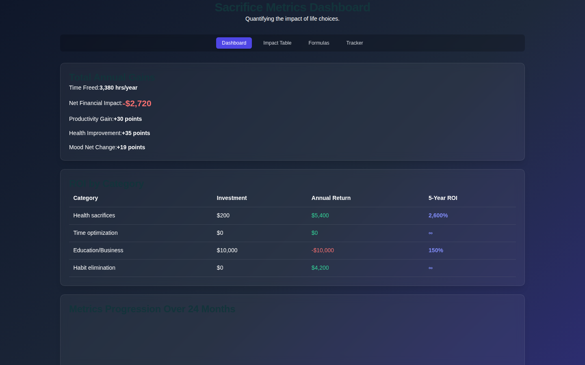

# Sacrifice Metrics Dashboard

A data-driven dashboard for quantifying the impact of life choices — tracking sacrifices, calculating opportunity cost, and visualizing trade-offs across four views: Dashboard, Impact Table, Formulas, and Tracker.



## Live Demo

**Live:** [https://kareembullard.github.io/sacrifice-metrics/](https://kareembullard.github.io/sacrifice-metrics/)

`index.html` is a fully self-contained single-file app (inline CSS/JS, no external dependencies) served directly from GitHub Pages — no build step. `Sacrifice_Metrics_Dashboard.html`, `Sacrifice_Metrics_Dashboard-STANDALONE.html`, and `sacrifice-metrics-dashboard_index.html` are redirect stubs pointing to `index.html`, kept only so old bookmarks/links don't 404. The legacy `app.js`/`style.css` files are no longer referenced.

## Features

- **Overview** — Summary stats and key sacrifice metrics as dependency-free CSS bar charts
- **Sacrifices** — Structured breakdown of choices and their cascading effects, category filter pills, full CRUD
- **ROI** — The math behind the metrics (opportunity cost, ROI of sacrifice), full CRUD
- **Progression** — Log and monitor ongoing sacrifices over time, full CRUD
- Light/dark theme toggle (shared portfolio-wide preference)
- Every card is click-to-edit directly, no separate Edit button

## Tech Stack

| Layer | Technology |
|---|---|
| Framework | React + TypeScript |
| Build | Vite |
| Charts | Chart.js |
| Styling | Tailwind CSS |

## React Version — Local Setup

**Prerequisites:** Node.js 18+

```bash
npm install
npm run dev
```

## Project Structure

```
├── App.tsx                        # Tab shell + routing
├── index.tsx                      # Entry point
├── constants.ts                   # Metric definitions + data
├── components/
│   ├── ui/                        # Shared UI components (TabButton, etc.)
│   ├── Dashboard.tsx              # Main dashboard view
│   ├── SacrificeImpactTable.tsx   # Detailed impact breakdown
│   ├── Formulas.tsx               # Formula documentation view
│   └── Tracker.tsx                # Ongoing sacrifice tracker
```

## About

Built by Kareem Bullard as part of the King Projects portfolio — a unique personal analytics tool that applies data science thinking to life decision-making. Demonstrates TypeScript component architecture, tabbed navigation, and Chart.js data visualization.
